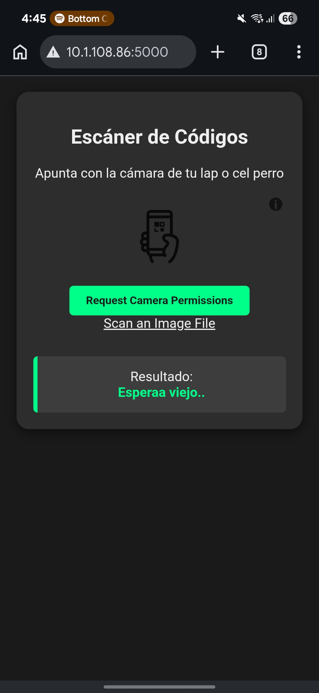
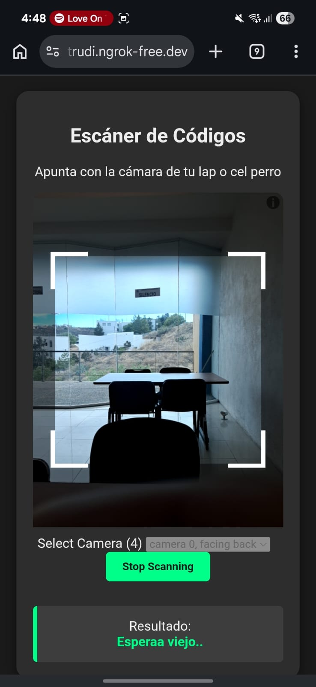
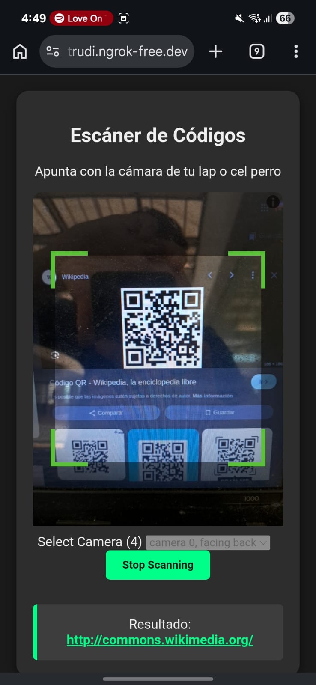
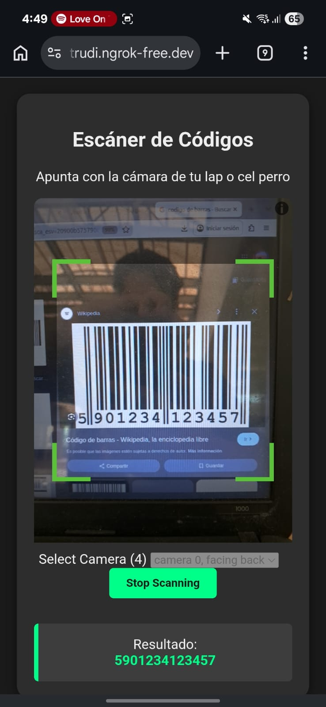

# Documentación del Proyecto: Escáner QR con Flask

## Introducción

Este proyecto consiste en una aplicación web desarrollada con Python y Flask que permite escanear códigos QR utilizando la cámara del dispositivo.

El sistema carga una página web donde se activa la cámara del celular o computadora, detecta códigos QR en tiempo real y muestra el contenido escaneado en pantalla.

Si el código contiene un enlace web, este se convierte automáticamente en un link clickeable.

---

# Tecnologías Utilizadas

- Python
- Flask
- HTML5
- CSS3
- JavaScript
- Librería html5-qrcode

---

# Estructura General del Código

```python
from flask import Flask, render_template_string
```

Se importan las herramientas necesarias de Flask:

- `Flask`: crea el servidor web.
- `render_template_string`: permite renderizar HTML guardado dentro de una variable de Python.

---

# Creación de la Aplicación

```python
app = Flask(__name__)
```

Aquí se inicializa la aplicación Flask.

---

# Plantilla HTML Integrada

```python
HTML_TEMPLATE = '''
...
'''
```

Todo el diseño HTML, CSS y JavaScript está guardado dentro de una variable tipo string.

---

# Diseño Visual (CSS)

- Fondo oscuro
- Texto claro
- Fuente moderna
- Caja central con bordes redondeados
- Área para cámara
- Caja de resultados

---

# Funcionamiento JavaScript

## Librería externa

```html
<script src="https://unpkg.com/html5-qrcode"></script>
```

Carga la librería que controla la cámara y detecta códigos QR.

## Función principal

```javascript
function onScanSuccess(decodedText, decodedResult)
```

Se ejecuta al detectar un QR y muestra el contenido.

Si empieza con `http`, lo convierte en enlace.

---

# Inicialización del Escáner

```javascript
let html5QrcodeScanner = new Html5QrcodeScanner(
    "reader",
    { fps: 10, qrbox: {width: 250, height: 250} },
    false
);
```

---

# Ruta Flask

```python
@app.route('/')
def index():
    return render_template_string(HTML_TEMPLATE)
```

---

# Ejecución

```python
app.run(host='0.0.0.0', port=5000, debug=True)
```

Permite entrar desde otros dispositivos en la misma red.

---

# ¿Funciona en teléfono?

Sí.

Solo abre la URL desde tu navegador móvil, acepta cámara y escanea.

Ejemplo:

```text
http://IP_DE_TU_PC:5000
```

o con ngrok:

```text
https://xxxxx.ngrok-free.app
```

---

# Capturas Recomendadas

## 1. Pantalla principal





## 2. Cámara activa




## 3. QR detectado




## 4. Link detectado




# Conclusión

Proyecto práctico que combina Flask con frontend moderno para crear un escáner QR funcional y compatible con computadora y celular.
