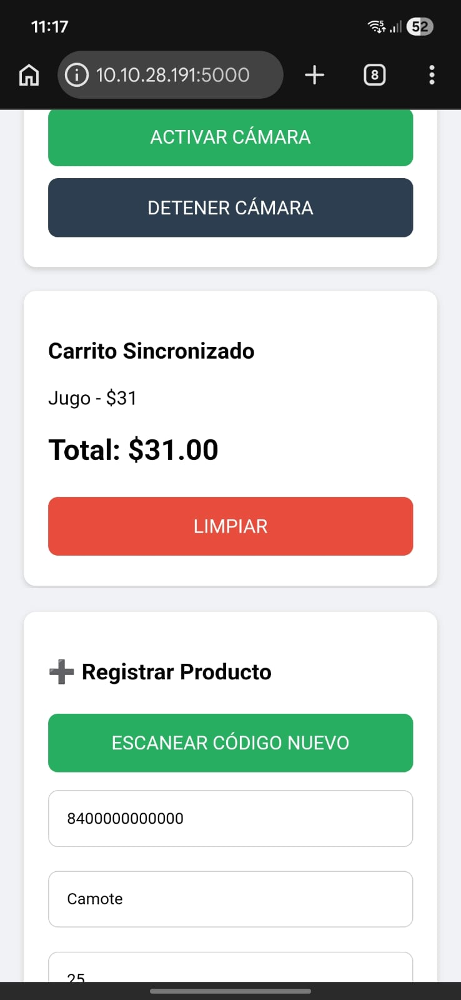
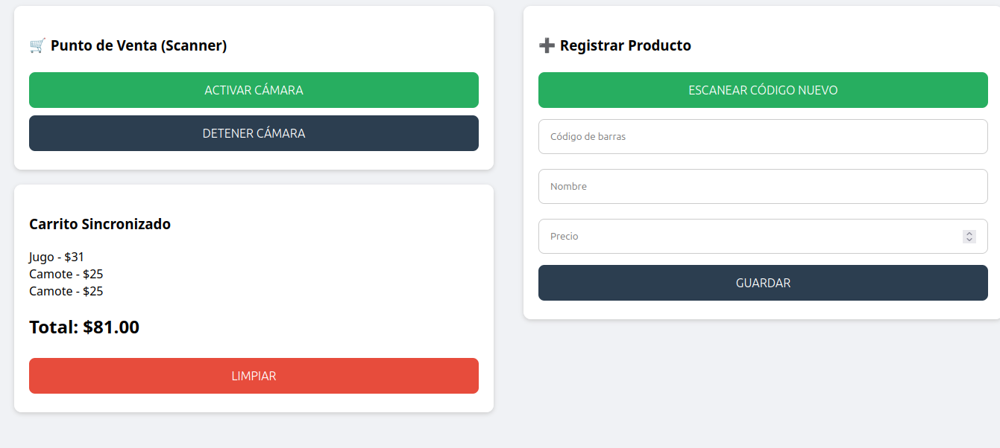

# Documentación Técnica: Sistema de Punto de Venta (POS) Móvil con Sincronización

## 1. Introducción
El presente documento describe la arquitectura y funcionalidad del Sistema de Punto de Venta (POS) desarrollado bajo una estructura de servidor local con interfaz cliente-servidor. Este sistema permite la gestión de inventarios, el registro de productos mediante escaneo de códigos de barras y la sincronización en tiempo real entre un dispositivo de captura (teléfono móvil) y una terminal de visualización (computadora portátil).

## 2. Arquitectura del Sistema
El sistema opera bajo un modelo de arquitectura centralizada utilizando Python y el framework Flask.

- **Backend (Servidor):** Implementado con Flask, gestiona la lógica de negocio, las peticiones HTTP y la persistencia de datos mediante SQLite.
- **Base de Datos:** SQLite actúa como el sistema de gestión de bases de datos relacionales, almacenando la información de los productos en la tabla `products` (barcode, name, price, stock).
- **Frontend (Cliente):** Interfaz desarrollada con HTML5, CSS y JavaScript, diseñada con un enfoque responsivo para adaptarse a diferentes dimensiones de pantalla.

## 3. Funcionalidades Principales

### 3.1. Gestión de Inventario
El módulo administrativo permite la inserción de nuevos productos en la base de datos. Se utiliza la cámara del dispositivo para capturar el código de barras, el cual es asignado al producto junto con su nombre y precio.

### 3.2. Punto de Venta (Scanner)
Permite el escaneo de productos mediante la cámara trasera del dispositivo móvil. Al detectar un código de barras, el sistema realiza una consulta a la base de datos para recuperar la información del producto y añadirla al carrito de ventas activo.

### 3.3. Sincronización en Tiempo Real
La sincronización se logra mediante un mecanismo de sondeo (polling). La interfaz de la computadora portátil (cliente de visualización) ejecuta una función de JavaScript cada segundo (`setInterval`), la cual realiza una petición al servidor (`/api/get_cart`) para obtener el estado actual del carrito compartido en memoria. Esto garantiza que cualquier acción realizada en el móvil se vea reflejada instantáneamente en la pantalla principal.

## 4. Tecnologías Empleadas

- **Lenguaje:** Python 3.x
- **Framework Web:** Flask (gestión de rutas y API)
- **Base de Datos:** SQLite3
- **Librería de Escaneo:** Html5Qrcode (acceso a la API de medios del navegador)
- **Frontend:** CSS Grid/Flexbox para el diseño responsivo

## 5. Instrucciones de Despliegue

1. **Requisitos Previos:**
   - Tener instalado Python 3.x.
   - Instalar las dependencias de Flask si es necesario.

2. **Ejecución del Servidor:**
   - Ejecutar el script `app.py`. El servidor se iniciará en la dirección IP local de la computadora (ejemplo: `10.10.28.191:5000`).

3. **Acceso a los Dispositivos:**
   - **Computadora (Servidor/Pantalla):** Acceder a través del navegador a `http://127.0.0.1:5000`.
   - **Teléfono Móvil (Escáner):** Acceder a la dirección IP asignada a la computadora dentro de la misma red Wi-Fi (ejemplo: `http://10.10.28.191:5000`).

## 6. Consideraciones de Seguridad y Privacidad

El acceso a la cámara es una funcionalidad restringida por los navegadores modernos. Para garantizar el funcionamiento correcto, se deben considerar los siguientes puntos:

- **Protocolo HTTPS:** Los navegadores web modernos imponen restricciones de seguridad que impiden el acceso a la cámara en conexiones HTTP no seguras (excepto en `localhost`).
- **Configuración de Permisos:** Es obligatorio otorgar permisos de acceso a la cámara cuando el navegador lo solicite tras presionar el botón de escaneo.
- **Entornos de Desarrollo:** En entornos locales, es posible que el navegador requiera una configuración de "orígenes inseguros" (en `chrome://flags`) para habilitar la API de medios si la conexión se realiza mediante una dirección IP numérica en lugar de un dominio con SSL.

---
*Este documento constituye una guía técnica para la implementación y uso del sistema POS descrito.*

## 7. Interfaz del Sistema

A continuación, se presentan las capturas de pantalla correspondientes a la interfaz del usuario en los dispositivos configurados.

### 7.1. Visualización en Dispositivo Móvil

### 7.2. Visualización en Computadora Portátil
